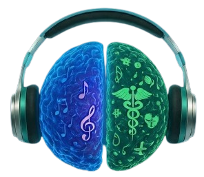

# SaudeSound - Memorização Acelerada para a Saúde

  

> **"Pare de estudar errado. Memorize o SUS brincando e garanta sua vaga."**

O **SaudeSound** é uma landing page de alta conversão focada no "Pack Músicas da Saúde". O projeto utiliza princípios da neurociência para transformar conteúdos densos, como decretos e anatomia, em músicas memorizáveis que facilitam o aprendizado de estudantes da área da saúde.

---

## 👥 Autores

Este projeto foi desenvolvido e é mantido por:

* **Raul Douglas**
* **André Pereira**
* **Poliana Oliveira**

## ⚠️ Aviso de Propriedade Intelectual

**Este projeto é protegido por direitos autorais. O plágio total ou parcial de código, design, textos ou áudios é estritamente proibido.** O uso indevido deste conteúdo sem autorização prévia dos autores está sujeito às medidas legais cabíveis.

---

## 🚀 Funcionalidades Principais

* **Abordagem Neurocientífica**: Áudios projetados especificamente para memorização acelerada.
* **Conteúdo Especializado**: Foco em legislações do SUS, decretos e anatomia complexa.
* **Interface Responsiva**: Design moderno desenvolvido com Tailwind CSS, otimizado para todos os tamanhos de tela.
* **Prova Social**: Comunidade com mais de 3.200 alunos aprovados.
* **Sistema de Urgência**: Cronômetro regressivo integrado para ofertas especiais.

## 🛠️ Tecnologias Utilizadas

Este projeto utiliza tecnologias modernas para garantir performance e escalabilidade:

* **React 18**: Biblioteca principal para construção da interface.
* **Vite**: Ferramenta de build de alta performance para o desenvolvimento.
* **Tailwind CSS**: Framework utilitário para estilização rápida e responsiva.
* **TypeScript**: Garantia de tipagem estática e segurança no código.
* **Phosphor Icons**: Biblioteca de ícones moderna e minimalista.

---

© 2026 SaudeSound - Todos os direitos reservados.
